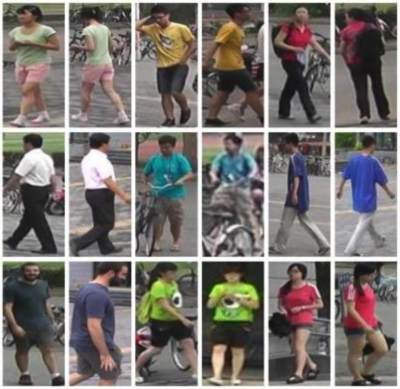

# Person Reidentification

## Introduction

This project addresses the challenge of person reidentification in computer vision, enabling the identification and matching of individuals across different camera views or timeframes. By using ResNet-50 and the Market-1501 dataset, I aim to provide a reliable solution for various real-world applications, including surveillance, security, and more.

## Problem Statement

### Understanding Person Reidentification

Person reidentification is a crucial task in computer vision, where the goal is to identify and match individuals across different camera views or timestamps. This is particularly challenging due to variations in lighting, pose, clothing, and occlusion. By solving this problem, we can enhance security, improve surveillance systems, and aid in various tracking applications.

## Data

### The Market-1501 Dataset

The model is trained on the Market-1501 dataset, a widely recognized benchmark for person reidentification research. It comprises images of 1,501 different individuals captured from six different cameras, simulating real-world scenarios. This dataset is essential for training and evaluating our model's performance.

### Data Preprocessing

Data preprocessing is a critical step in building a successful model. To ensure our model's effectiveness, I applied the following transformations:

- Resizing and cropping to a consistent size.
- Data augmentation techniques, such as random cropping and horizontal flipping.
- Normalization to standardize image pixel values.

## Model Architecture

### ResNet-50 Architecture

The model is built upon the ResNet-50 architecture, known for its strong feature extraction capabilities. I've made customizations to adapt it to the specific task of person reidentification. The model's output is designed for person identification, making it suitable for the task at hand.

## Results

### Training and Validation Results

Here are the key results from training the model after 20 epochs:

  - Train Loss: 5.1421, Train Acc: 0.1483
  - Val Loss: 5.3689, Val Acc: 0.0959

These results demonstrate the model's progress in learning to identify individuals as training advances. The increasing accuracy on the validation set indicates the model's improved performance.
